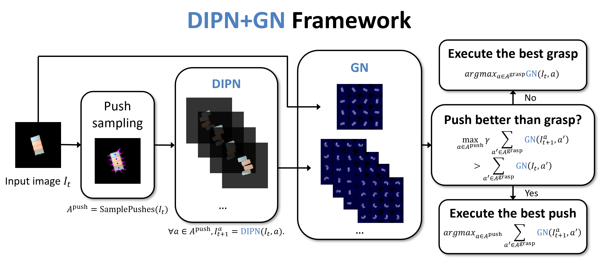
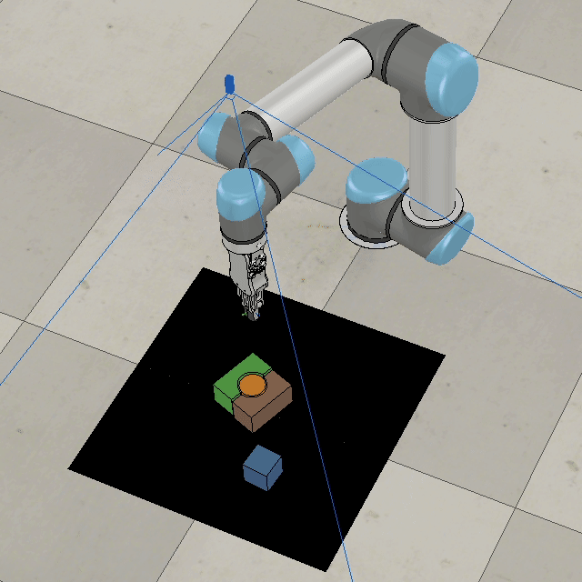
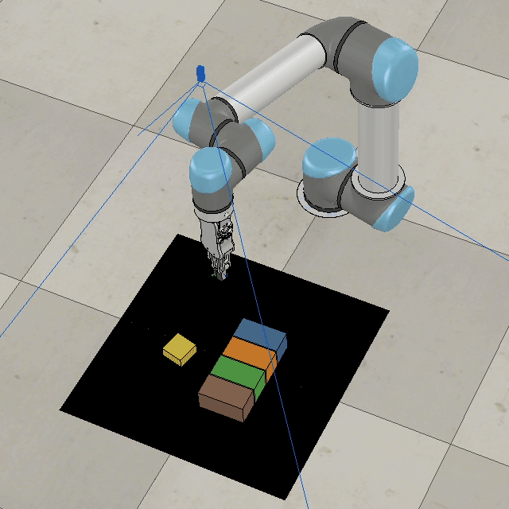
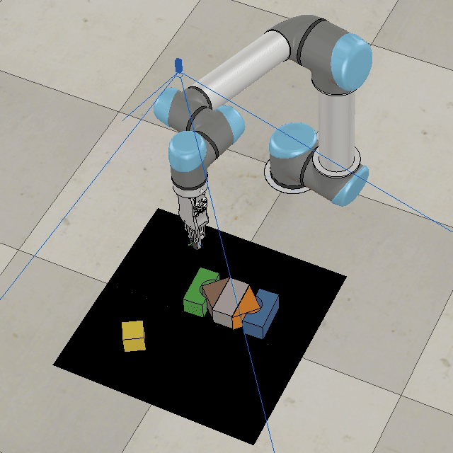
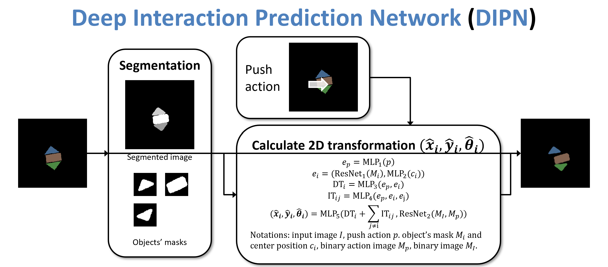
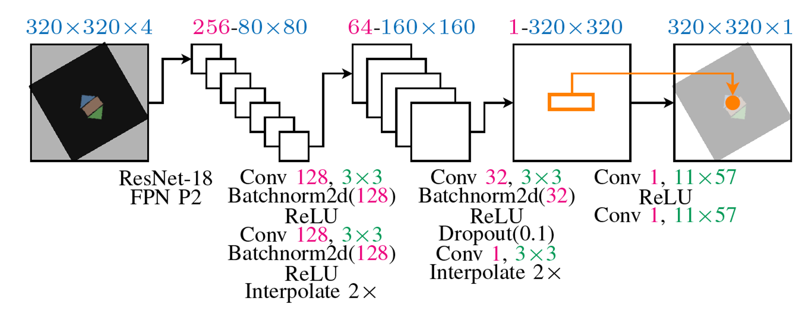

# DIPN: Deep Interaction Prediction Network with Application to Clutter Removal

We propose a Deep Interaction Prediction Network (DIPN) for learning to predict complex interactions that ensue as a robot end-effector pushes multiple objects, whose physical properties, including size, shape, mass, and friction coefficients may be unknown a priori. DIPN "imagines" the effect of a push action and generates an accurate synthetic image of the predicted outcome. DIPN is shown to be sample efficient when trained in simulation or with a real robotic system. The high accuracy of DIPN allows direct integration with a Grasp Network (GN), yielding a robotic manipulation system capable of executing challenging clutter removal tasks while being trained in a fully self-supervised manner. The overall network demonstrates intelligent behavior in selecting proper actions between push and grasp for completing clutter removal tasks and significantly outperforms the previous state-of-the-art [VPG](https://github.com/andyzeng/visual-pushing-grasping).

**Videos:**

[](http://www.youtube.com/watch?v=CNkZfZ-0Du8 "DIPN")

<p float="left">
    
    
</p>


**Paper:** https://arxiv.org/abs/2011.04692

### Demo videos of a real robot in action can be found [here](https://drive.google.com/drive/folders/1QoTaMjdrcaeiECFNbW58DF_iFdrL-icJ?usp=sharing) (no editing).


## Installation
This implementation requires the following dependencies (tested on Ubuntu 18.04.5 LTS, GTX 2080 Ti / GTX 1070):
* Python 3
    * NumPy, SciPy, OpenCV-Python, Matplotlib, PyTorch==1.6.0, torchvision==0.7.0, Shapely, Tensorboard, Pillow, imutils, scikit-image, pycocotools (use pip or conda to install)
      ```shell
      conda install matplotlib numpy scipy pillow scikit-image
      conda install -c conda-forge opencv shapely tensorboard imutils pycocotools
      conda install pytorch==1.6.0 torchvision==0.7.0 cudatoolkit=10.2 -c pytorch
      ```
* CoppeliaSim, the simulation environment
* GPU, 8GB memory is tested.

Note: To pre-train Grasp Network, it requires pytorch==1.5.1 and torchvision==0.6.1 due to a bug from torchvision

## Quick Start (Simulation)
1. Download this repo `git clone https://github.com/rutgers-arc-lab/dipn.git`
1. Download models (download folders and unzip) from [Google Drive](https://drive.google.com/drive/folders/1QETtCBPeOGkdwYzzWl-yXUvhrHRx_8n3?usp=sharing) and put them in `dipn` folder
1. Navigate to folder which contains CoppeliaSim and run `bash coppeliaSim.sh ~/dipn/simulation/simulation_new_4.1.0.ttt`
1. Run `bash run.sh`
<p float="left">
    
    
    
</p>

## Evaluation
Data from each test case will be saved into a session directory in the `logs` folder. To report the average testing performance over a session, run the following:
```shell
python utils/evaluate.py --session_directory 'logs/YOUR-SESSION-DIRECTORY-NAME-HERE' --method 'reinforcement' --num_obj_complete N
```

## Train Mask R-CNN
We used the simulation to generate two types of data, one is randomly dropped, one is some randomly generated "hard" cases.
The "hard" cases is mainly used for fine-tuning process so the Mask R-CNN can distinguish packed objects with same color.
`random-maskrcnn` and `random-maskrcnn-hard` contain objects which have different shapes and colors to the final objects that will be trained and evaluted on.
```shell
python train_maskrcnn.py --dataset_root 'logs/random-maskrcnn/data'
cd logs/random-maskrcnn/data/maskrcnn.pth logs/random-maskrcnn-hard/data
python train_maskrcnn.py --dataset_root 'logs/random-maskrcnn-hard/data' --epochs 10 --resume
```


## Train Interactive Prediction Network
We count the dataset `push` as part of training action, we used 1500 actions so the `--cutoff 15`.
To mimic the real world setup, for a 10 cm push, we only used the 0 to 5 cm to train the model.
Nevertheless, dataset `random` could also be used, it provides a little bit worse prediction accuracy, but we do not need piror knowledge about the objects and it's in the simulation, so, we can use as many data as we want for free.
```shell
python train_push_prediction.py --dataset_root 'logs_push/push/data' --distance 5 --epoch 50 --cutoff 15 --batch_size 8 
```




## Pre-train Grasp Network and Train Grasp Network in simluation
Switch to pytorch==1.5.1 and torchvision==0.6.1.
`random-pretrain` contains objects which have different shapes and colors to the final objects that will be trained and evaluted on.
`random-pretrain` could be replaced with `random-maskrcnn`, they are essentially collected in the same way.
You may need to restart the training several times, so the loss will go down to around 60.
```shell
python train_foreground.py --dataset_root 'logs/random-pretrain/data'
```

To use DIPN+GN, we just need to train Grasp Network in simluation.
```shell
python main.py --is_sim --grasp_only --experience_replay --explore_rate_decay --save_visualizations --load_snapshot --snapshot_file 'logs/random-pretrain/data/foreground_model.pth' 
```




## Train DQN + GN
It will train DQN grasp and push in the same time, which is one of baseline in the paper.
```shell
python main.py --is_sim --push_rewards --experience_replay --explore_rate_decay --save_visualizations --load_snapshot --snapshot_file 'logs/random-pretrain/data/foreground_model.pth' 
```

## Creating dataset
The dataset we used can be download from [Google Drive](https://drive.google.com/drive/folders/17X5aGr-50e6RqLkyyvG4mGHP_TUpz_kB?usp=sharing).
The Push prediction related files are located in `logs_push`
The Mask R-CNN, Grasp Network related files are located in `logs`

### collect_data.py
Collect push prediction data (only for sim now).
```shell
python collect_data.py --is_sim
```

### create_mask_rcnn_image.py
Collect dataset for Mask R-CNN and pre-training, `--is_mask` collects data for Mask R-CNN.
You need to drag the `Box` object to the center in CoppeliaSim.
```shell
python create_mask_rcnn_image.py --is_sim --num_obj N --is_mask
```

## Creating Your Own Test Cases in Simulation

To design your own challenging test case:

1. Open the simulation environment in CoppeliaSim (navigate to your CoppeliaSim directory and run `bash coppeliaSim.sh ~/dipn/simulation/simulation_new_4.1.0.ttt`).
1. In another terminal window, navigate to this repository and run the following:

    ```shell
    python create.py
    ```

1. In the CoppeliaSim window, use the CoppeliaSim toolbar (object shift/rotate) to move around objects to desired positions and orientations.
1. In the terminal window type in the name of the text file for which to save the test case, then press enter.
1. Try it out: run a trained model on the test case by running `push_main.py` just as in the demo, but with the flag `--test_preset_file` pointing to the location of your test case text file.

## Running on a Real Robot (UR5e)

Change `is_real` in `constants.py` to `True`

### Setup camera Instruction will be available soon
1. Download and install [librealsense SDK 2.0](https://github.com/IntelRealSense/librealsense)

### Quick Start
The workflow is the same as in the simulation.
The software version of UR5e is URSoftware 5.1.1.
1. Use `touch.py` and `debug.py` to test the robot first.
1. Download the dataset [Google Drive](https://drive.google.com/drive/folders/17X5aGr-50e6RqLkyyvG4mGHP_TUpz_kB?usp=sharing).
1. Put the downloaded folders to `dipn`. Change the path of model in the code `push_main.py`, line 83 & 88. The pre-trained DIPN is in `logs_push/push/data/15_push_prediction_model.pth`, the Mask R-CNN is in `logs/real-data/data/maskrcnn.pth`, 
1. Place Your objects on the workspace.
1. Run `python push_main.py --save_visualizations --is_testing --load_snapshot --snapshot_file 'logs/real-GN/model/models/snapshot-000500.reinforcement.pth'

### Training
1. Fine-tune the Mask R-CNN with real data `real-data`.
2. Fine-tune the pre-training of Grasp Network with real data `real-data`.
3. Train the Grasp Network with the real robot.

### Additional Tools

* Use `touch.py` to test calibrated camera extrinsics -- provides a UI where the user can click a point on the RGB-D image, and the robot moves its end-effector to the 2D location of that point.
* Use `debug.py` to test robot communication and primitive actions.
* Use `utils/range-detector.py` to find the color range.
* Use `utils/mask-auto-annotate.py` to automatically annotate objects by color.

# Info
The code has dependencies over https://github.com/andyzeng/visual-pushing-grasping". 

The code contaies DINP and DQN + GN
